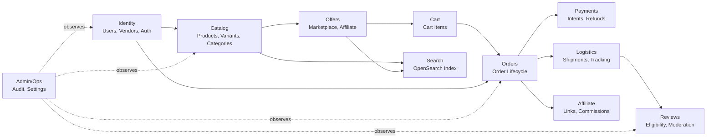

# Domain Map — Bounded Contexts

## Overview

10 bounded contexts with strict ownership rules. Domains communicate via EventBus (NestJS EventEmitter2). No cross-module entity imports.

## Domain Dependency Diagram

## Domain Detail

### Identity
- **Owns:** users, vendors, vendor_staff, refresh_tokens
- **Publishes:** UserRegistered, VendorApproved, VendorSuspended
- **Consumes from:** —
- **Exposes to other domains:** UserService.findById(), VendorService.findById()

### Catalog
- **Owns:** products, variants, categories, brands, product_images, product_attributes
- **Publishes:** ProductCreated, ProductUpdated, ProductApproved, VariantCreated
- **Consumes from:** Identity (vendor ownership validation)
- **Exposes:** ProductService.findById(), CategoryService.getTree()

### Offers
- **Owns:** offers
- **Publishes:** OfferCreated, OfferUpdated, OfferDeactivated, StockChanged
- **Consumes from:** Catalog (product/variant existence)
- **Exposes:** OfferService.findById(), OfferService.reserveStock()

### Cart
- **Owns:** carts, cart_items
- **Publishes:** CartUpdated
- **Consumes from:** Offers (price/stock validation)
- **Exposes:** CartService.getCartForUser()

### Orders
- **Owns:** orders, order_items, order_status_history
- **Publishes:** OrderCreated, OrderConfirmed, OrderCancelled, OrderCompleted
- **Consumes from:** Cart (cart items), Offers (validation), Identity (user), Payments (PaymentSucceeded/Failed)
- **Exposes:** OrderService.findById(), OrderService.findByVendor()

### Payments
- **Owns:** payments, payment_attempts, refunds
- **Publishes:** PaymentSucceeded, PaymentFailed, RefundIssued
- **Consumes from:** Orders (OrderCreated)
- **Exposes:** PaymentService.getPaymentForOrder()

### Logistics
- **Owns:** shipments, shipment_items, shipment_tracking_events
- **Publishes:** ShipmentCreated, ShipmentShipped, ShipmentDelivered
- **Consumes from:** Orders (OrderConfirmed)
- **Exposes:** ShipmentService.findByOrder()

### Reviews
- **Owns:** review_eligibility, reviews, review_media
- **Publishes:** ReviewSubmitted, ReviewApproved, ReviewRejected
- **Consumes from:** Logistics (ShipmentDelivered)
- **Exposes:** ReviewService.getProductReviews(), ReviewService.getRatingSummary()

### Affiliate
- **Owns:** affiliate_links, affiliate_clicks, affiliate_commissions
- **Publishes:** AffiliateClickTracked, CommissionCalculated
- **Consumes from:** Orders (OrderCompleted)
- **Exposes:** AffiliateService.trackClick()

### Admin/Ops
- **Owns:** audit_logs, platform_settings
- **Publishes:** —
- **Consumes from:** All domains (audit trail via AuditLog event)
- **Exposes:** AuditService.log(), SettingsService.get()

## Boundary Rules

1. Module A **never imports** Module B's TypeORM entities
2. Cross-domain data flows through **domain events** (fire-and-forget side effects) or **service interfaces** (synchronous queries)
3. Foreign keys in the database reference IDs across domains, but application code treats them as opaque references
4. The `common/` module is shared infrastructure — not a domain
