# Entity Relationship Diagram

## Overview

~25 tables across 10 domains. All tables use UUID primary keys, `created_at`/`updated_at` timestamps. Soft-deletable tables include `deleted_at`.

## Full ERD

```mermaid
erDiagram
    %% Identity
    users {
        uuid id PK
        varchar email UK
        varchar password_hash
        varchar first_name
        varchar last_name
        varchar phone
        varchar role
        boolean email_verified
        boolean is_active
        timestamptz last_login_at
    }

    vendors {
        uuid id PK
        uuid user_id FK
        varchar business_name
        varchar slug UK
        varchar business_email
        char country_code
        varchar status
        decimal commission_rate
        timestamptz approved_at
    }

    vendor_staff {
        uuid id PK
        uuid vendor_id FK
        uuid user_id FK
        jsonb permissions
    }

    refresh_tokens {
        uuid id PK
        uuid user_id FK
        varchar token_hash UK
        timestamptz expires_at
        boolean revoked
    }

    %% Catalog
    categories {
        uuid id PK
        uuid parent_id FK
        varchar name
        varchar slug UK
        integer sort_order
        boolean is_active
    }

    brands {
        uuid id PK
        varchar name
        varchar slug UK
        boolean is_active
    }

    products {
        uuid id PK
        uuid vendor_id FK
        uuid category_id FK
        uuid brand_id FK
        varchar name
        varchar slug UK
        text description
        varchar status
        timestamptz deleted_at
    }

    variants {
        uuid id PK
        uuid product_id FK
        varchar sku UK
        varchar name
        integer weight_grams
        jsonb dimensions_cm
        boolean is_active
    }

    product_images {
        uuid id PK
        uuid product_id FK
        uuid variant_id FK
        varchar url
        integer sort_order
        boolean is_primary
    }

    product_attributes {
        uuid id PK
        uuid product_id FK
        uuid variant_id FK
        varchar attribute_name
        varchar attribute_value
    }

    %% Offers
    offers {
        uuid id PK
        uuid product_id FK
        uuid variant_id FK
        uuid vendor_id FK
        varchar offer_type
        varchar status
        char country_code
        integer price_amount
        char price_currency
        integer compare_at_price
        integer stock_quantity
        integer stock_reserved
        varchar affiliate_url
        varchar fulfillment_type
        timestamptz deleted_at
    }

    %% Cart
    carts {
        uuid id PK
        uuid user_id FK
        varchar session_id
        char country_code
    }

    cart_items {
        uuid id PK
        uuid cart_id FK
        uuid offer_id FK
        integer quantity
        integer price_snapshot
        char currency
    }

    %% Orders
    orders {
        uuid id PK
        varchar order_number UK
        uuid user_id FK
        char country_code
        varchar status
        integer subtotal
        integer shipping_total
        integer tax_total
        integer grand_total
        char currency
        jsonb shipping_address
        varchar idempotency_key UK
    }

    order_items {
        uuid id PK
        uuid order_id FK
        uuid offer_id FK
        uuid vendor_id FK
        varchar product_name
        varchar variant_name
        varchar sku
        integer quantity
        integer unit_price
        integer total_price
        varchar offer_type
        varchar status
    }

    order_status_history {
        uuid id PK
        uuid order_id FK
        varchar from_status
        varchar to_status
        uuid changed_by FK
        text reason
        jsonb metadata
    }

    %% Payments
    payments {
        uuid id PK
        uuid order_id FK
        integer amount
        char currency
        varchar status
        varchar gateway
        varchar gateway_payment_id UK
        varchar payment_method
        varchar idempotency_key UK
        timestamptz paid_at
    }

    payment_attempts {
        uuid id PK
        uuid payment_id FK
        jsonb gateway_response
        varchar status
        text error_message
    }

    refunds {
        uuid id PK
        uuid payment_id FK
        uuid order_id FK
        integer amount
        char currency
        varchar status
        varchar gateway_refund_id UK
        varchar idempotency_key UK
    }

    %% Logistics
    shipments {
        uuid id PK
        uuid order_id FK
        uuid vendor_id FK
        varchar tracking_number
        varchar carrier
        varchar status
        timestamptz shipped_at
        timestamptz delivered_at
    }

    shipment_items {
        uuid id PK
        uuid shipment_id FK
        uuid order_item_id FK
        integer quantity
    }

    shipment_tracking_events {
        uuid id PK
        uuid shipment_id FK
        varchar status
        text description
        varchar location
        timestamptz occurred_at
        jsonb raw_payload
    }

    %% Reviews
    review_eligibility {
        uuid id PK
        uuid order_id FK
        uuid order_item_id FK
        uuid user_id FK
        uuid product_id FK
        uuid variant_id FK
        varchar status
        timestamptz eligible_until
        varchar idempotency_key UK
    }

    reviews {
        uuid id PK
        uuid review_eligibility_id FK
        uuid user_id FK
        uuid product_id FK
        uuid variant_id FK
        smallint rating
        varchar title
        text body
        varchar status
        uuid moderated_by FK
        varchar idempotency_key UK
    }

    review_media {
        uuid id PK
        uuid review_id FK
        varchar media_type
        varchar url
        integer sort_order
    }

    %% Affiliate
    affiliate_links {
        uuid id PK
        uuid offer_id FK
        varchar code UK
        varchar target_url
        integer click_count
        boolean is_active
    }

    affiliate_clicks {
        uuid id PK
        uuid affiliate_link_id FK
        uuid user_id FK
        varchar ip_address
        char country_code
        timestamptz clicked_at
    }

    affiliate_commissions {
        uuid id PK
        uuid affiliate_link_id FK
        uuid order_id FK
        integer amount
        char currency
        varchar status
        varchar idempotency_key UK
    }

    %% Admin
    audit_logs {
        uuid id PK
        uuid user_id FK
        varchar action
        varchar entity_type
        uuid entity_id
        jsonb changes
        varchar ip_address
    }

    platform_settings {
        uuid id PK
        varchar key
        jsonb value
        char country_code
        text description
    }

    %% Relationships
    users ||--o{ vendors : "owns"
    users ||--o{ refresh_tokens : "has"
    users ||--o{ vendor_staff : "works as"
    vendors ||--o{ vendor_staff : "has staff"
    vendors ||--o{ products : "creates"
    vendors ||--o{ offers : "lists"
    vendors ||--o{ shipments : "ships"
    categories ||--o{ categories : "parent of"
    categories ||--o{ products : "contains"
    brands ||--o{ products : "makes"
    products ||--o{ variants : "has"
    products ||--o{ product_images : "shows"
    products ||--o{ product_attributes : "describes"
    products ||--o{ offers : "priced by"
    variants ||--o{ offers : "offered as"
    variants ||--o{ product_images : "shows"
    offers ||--o{ cart_items : "in cart"
    offers ||--o{ order_items : "ordered as"
    offers ||--o{ affiliate_links : "tracked by"
    carts ||--o{ cart_items : "contains"
    users ||--o{ carts : "owns"
    users ||--o{ orders : "places"
    orders ||--o{ order_items : "contains"
    orders ||--o{ order_status_history : "tracked by"
    orders ||--o{ payments : "paid by"
    orders ||--o{ shipments : "shipped as"
    orders ||--o{ refunds : "refunded by"
    payments ||--o{ payment_attempts : "attempted"
    payments ||--o{ refunds : "refunded"
    shipments ||--o{ shipment_items : "contains"
    shipments ||--o{ shipment_tracking_events : "tracked"
    order_items ||--o{ shipment_items : "shipped in"
    order_items ||--o| review_eligibility : "eligible for"
    review_eligibility ||--o| reviews : "results in"
    reviews ||--o{ review_media : "includes"
    affiliate_links ||--o{ affiliate_clicks : "clicked"
    affiliate_links ||--o{ affiliate_commissions : "earns"
```

## Table Count by Domain

| Domain | Tables | Key Tables |
|--------|--------|------------|
| Identity | 4 | users, vendors, vendor_staff, refresh_tokens |
| Catalog | 6 | products, variants, categories, brands, product_images, product_attributes |
| Offers | 1 | offers |
| Cart | 2 | carts, cart_items |
| Orders | 3 | orders, order_items, order_status_history |
| Payments | 3 | payments, payment_attempts, refunds |
| Logistics | 3 | shipments, shipment_items, shipment_tracking_events |
| Reviews | 3 | review_eligibility, reviews, review_media |
| Affiliate | 3 | affiliate_links, affiliate_clicks, affiliate_commissions |
| Admin/Ops | 2 | audit_logs, platform_settings |
| **Total** | **30** | |
