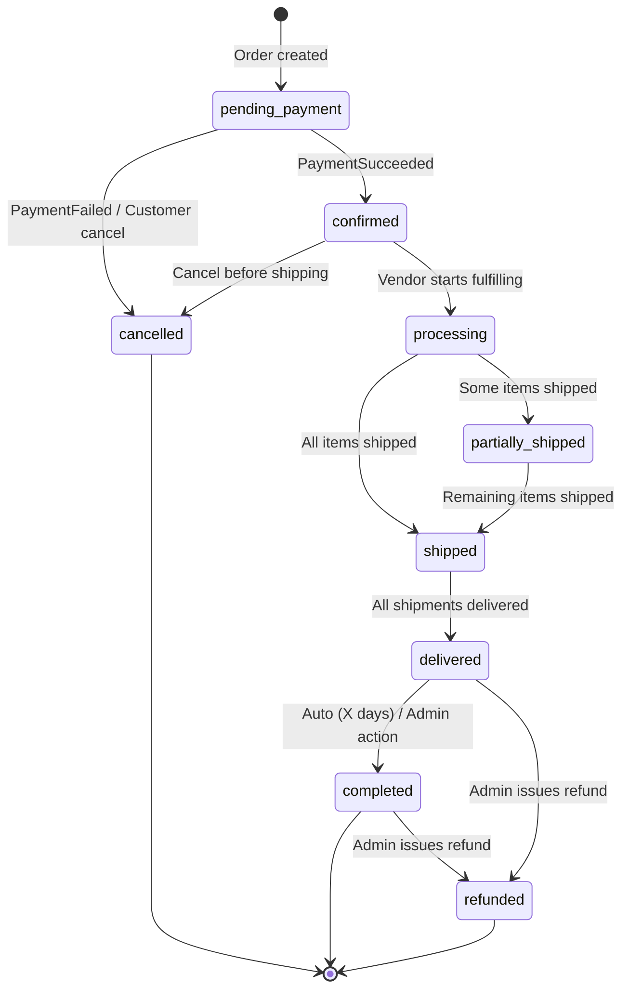
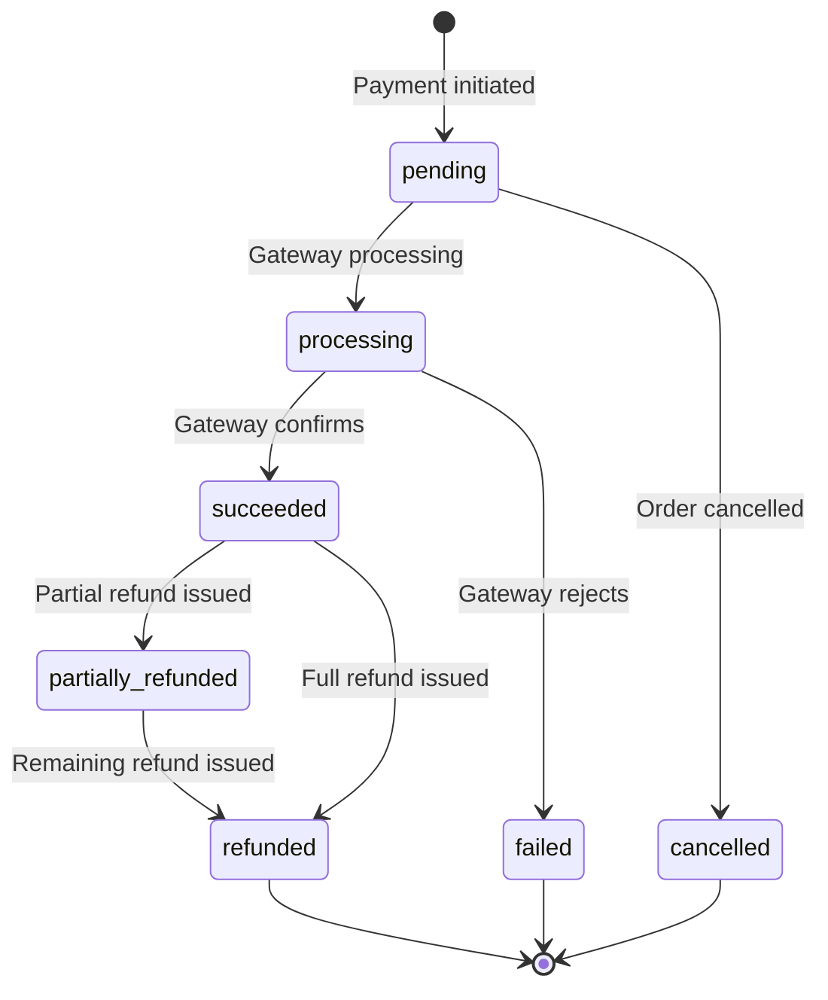
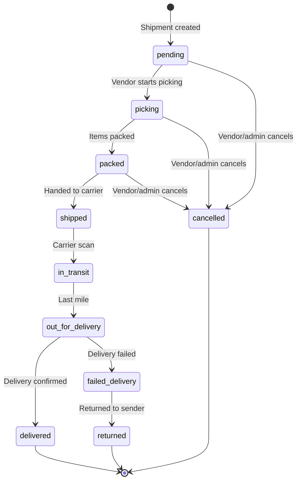
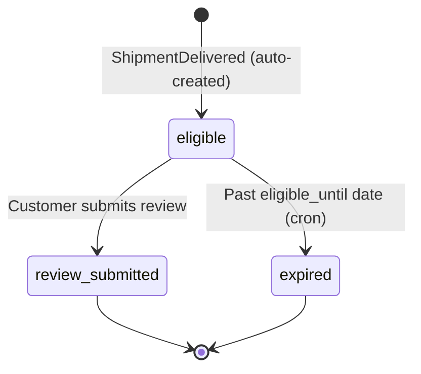
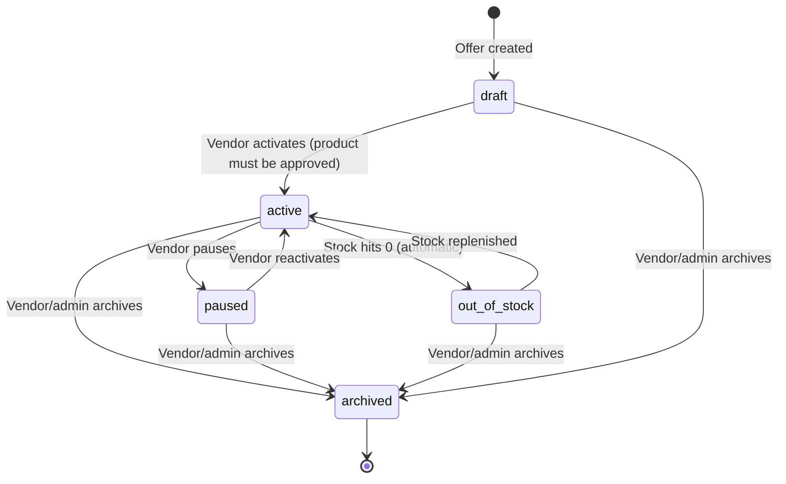

# State Machine Diagrams

## 1. Order Lifecycle



### Transition Table

| From | To | Trigger | Side Effects |
|------|-----|---------|-------------|
| pending_payment | confirmed | PaymentSucceeded event | Notify vendor, record history |
| pending_payment | cancelled | PaymentFailed / customer cancel | Release reserved stock, record history |
| confirmed | processing | Vendor starts fulfilling | Record history |
| confirmed | cancelled | Customer/admin cancel | Release stock, trigger refund, record history |
| processing | partially_shipped | Some shipments created | Record history |
| processing | shipped | All items have shipments marked shipped | Record history |
| partially_shipped | shipped | Remaining shipments shipped | Record history |
| shipped | delivered | All shipments delivered | Record history, emit OrderDelivered |
| delivered | completed | Auto after configurable days / admin | Create review eligibility, emit OrderCompleted |
| completed | refunded | Admin issues refund | Trigger RefundIssued, record history |
| delivered | refunded | Admin issues refund | Trigger RefundIssued, record history |

---

## 2. Payment Lifecycle



### Transition Table

| From | To | Trigger | Side Effects |
|------|-----|---------|-------------|
| pending | processing | Gateway starts processing | Create payment_attempt |
| pending | cancelled | Order cancelled before payment | — |
| processing | succeeded | Gateway confirms payment | Emit PaymentSucceeded, update paid_at |
| processing | failed | Gateway rejects | Emit PaymentFailed, log error |
| succeeded | partially_refunded | Admin partial refund | Create refund record |
| succeeded | refunded | Admin full refund | Create refund record, emit RefundIssued |
| partially_refunded | refunded | Admin remaining refund | Update refund record |

---

## 3. Shipment Lifecycle



### Transition Table

| From | To | Trigger | Side Effects |
|------|-----|---------|-------------|
| pending | picking | Vendor starts picking | — |
| pending | cancelled | Cancel request | Update order item status |
| picking | packed | Items packed | — |
| packed | shipped | Handed to carrier, tracking added | Update shipped_at, emit ShipmentShipped |
| shipped | in_transit | Carrier tracking update | Log tracking event |
| in_transit | out_for_delivery | Carrier tracking update | Log tracking event |
| out_for_delivery | delivered | Delivery confirmed | Update delivered_at, emit ShipmentDelivered |
| out_for_delivery | failed_delivery | Delivery failed | Log tracking event |
| failed_delivery | returned | Return confirmed | Log tracking event |
| Any pre-shipped | cancelled | Vendor/admin action | Update order item status |

---

## 4. Review Eligibility Lifecycle



### Transition Table

| From | To | Trigger | Side Effects |
|------|-----|---------|-------------|
| eligible | review_submitted | Customer submits review | Link review to eligibility |
| eligible | expired | Cron job: `eligible_until < NOW()` | — |

### Rules
- Created idempotently: `UNIQUE(order_item_id)`, idempotency_key = f(order_item_id)
- `eligible_until` = delivery date + 90 days (configurable via platform_settings)

---

## 5. Offer Status



### Transition Table

| From | To | Trigger | Side Effects |
|------|-----|---------|-------------|
| draft | active | Vendor activates | Validate: product approved, vendor active. Emit OfferCreated |
| active | paused | Vendor pauses | Emit OfferDeactivated (remove from search) |
| active | out_of_stock | stock_quantity reaches 0 | Automatic. Emit OfferDeactivated |
| active | archived | Vendor/admin archives | Emit OfferDeactivated |
| paused | active | Vendor reactivates | Validate: product still approved. Emit OfferUpdated |
| out_of_stock | active | Stock replenished (stock_quantity > 0) | Emit OfferUpdated |
| Any | archived | Vendor/admin archives | Emit OfferDeactivated, soft delete |

### Rules
- An offer can only become `active` if the linked product has `status = 'approved'` and the vendor has `status = 'approved'`
- Stock changes are atomic: `UPDATE offers SET stock_quantity = stock_quantity - :qty WHERE stock_quantity >= :qty`
- Archived offers are soft-deleted and excluded from search

---

## Implementation Notes

Each state machine is implemented as a dedicated method in the domain service:

```typescript
// Pattern for all state machines
class OrderService {
  private readonly VALID_TRANSITIONS: Record<OrderStatus, OrderStatus[]> = {
    [OrderStatus.PENDING_PAYMENT]: [OrderStatus.CONFIRMED, OrderStatus.CANCELLED],
    [OrderStatus.CONFIRMED]: [OrderStatus.PROCESSING, OrderStatus.CANCELLED],
    // ...
  };

  async transitionOrder(
    orderId: string,
    newStatus: OrderStatus,
    changedBy?: string,
    reason?: string,
  ): Promise<Order> {
    const order = await this.orderRepo.findOneOrFail(orderId);
    const allowed = this.VALID_TRANSITIONS[order.status];

    if (!allowed?.includes(newStatus)) {
      throw new InvalidStateTransitionException(
        'Order', order.status, newStatus
      );
    }

    order.status = newStatus;
    await this.orderRepo.save(order);
    await this.recordStatusHistory(order, newStatus, changedBy, reason);
    await this.eventBus.emit(new OrderStatusChanged(order, newStatus));

    return order;
  }
}
```
